# Pacman Artificial Intelligence Project


<p align="center">
  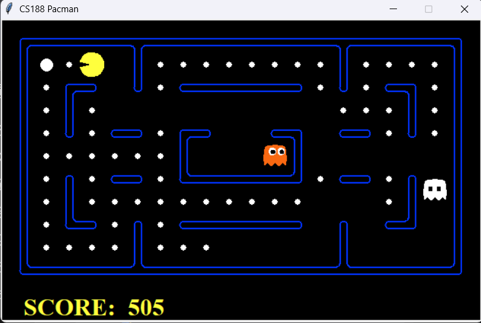
</p>

## Description

This project implements several **Artificial Intelligence algorithms** for controlling Pacman in a maze environment.  
The objective is to develop intelligent agents capable of navigating the maze, collecting food, and avoiding ghosts using classical **search algorithms and multi-agent decision-making techniques**.  
The project is based on the well-known **Pacman AI framework developed by UC Berkeley (CS188)** and includes implementations for both **search algorithms** and **multi-agent adversarial search**.


## Project Components  
The project contains two main parts:

### Search Algorithms + Search Problems
Implementation of classical graph search algorithms used to find optimal paths in the Pacman environment.  
In addition to implementing classical search algorithms, the project also includes several complex search problems that require designing appropriate state representations and heuristic functions.

The following search algorithms were implemented:

#### *Depth First Search (DFS)*

DFS explores the deepest nodes of the search tree first.  
Characteristics:

- Uses a stack data structure
- Explores one branch completely before backtracking
- May not find the shortest path

<p align="center">
  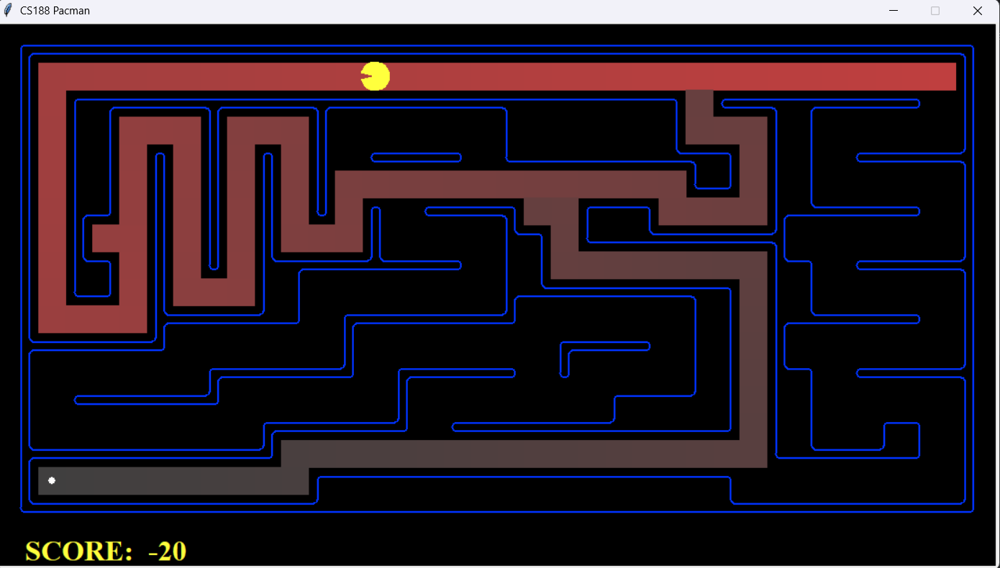
</p>

#### *Breadth First Search (BFS)*

BFS explores the search tree level by level.  
Characteristics:

- Uses a queue data structure
- Guarantees finding the shortest path in unweighted graphs

<p align="center">
  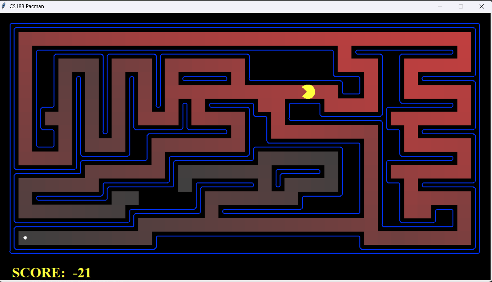
</p>

#### *Uniform Cost Search (UCS)*

UCS expands nodes with the lowest path cost first.  
Characteristics:

- Uses a priority queue
- Guarantees optimal solutions

<p align="center">
  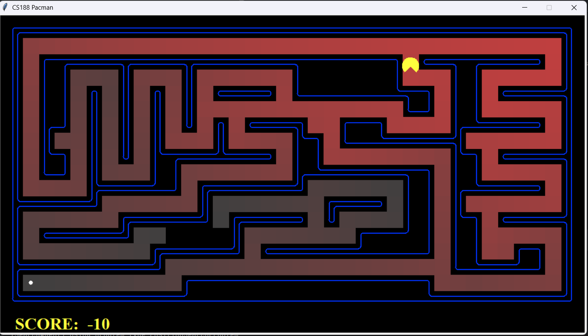
</p>

#### *A star Search*

A* combines path cost with a heuristic function.  
Formula:

```
f(n) = g(n) + h(n)
```

Where:

- `g(n)` = cost from start node
- `h(n)` = heuristic estimate to goal

Characteristics:

- Efficient pathfinding
- Guarantees optimal solutions with admissible heuristics

<p align="center">
  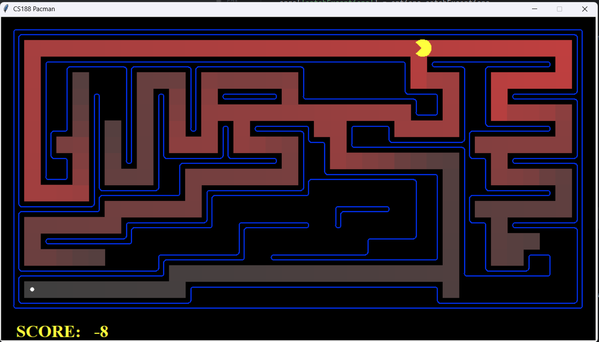
</p>


Search problems simulate realistic navigation challenges for the Pacman agent:

#### *Finding All the Corners (Corners Problem)*

In the **Corners Problem**, Pacman must find a path that visits all four corners of the maze.  
The difficulty of this problem lies in designing an appropriate **state representation** that keeps track of:

- Pacman's current position
- which corners have already been visited

The state space therefore includes both the position and the visited corners.   
To solve this problem efficiently, a heuristic function was implemented to estimate the remaining distance required to visit all remaining corners.

<p align="center">
  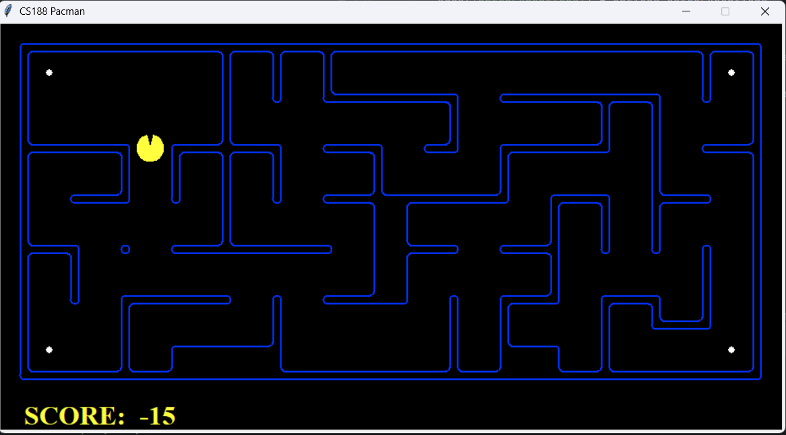
</p>


#### *Corners Problem Heuristic*

A heuristic function was designed to guide the A* search algorithm in solving the Corners Problem efficiently.  
The heuristic estimates the remaining distance needed to visit all unvisited corners.  
Typical approaches include computing:

- the Manhattan distance to the closest corner
- the sum of distances between remaining corners

The heuristic must remain **admissible and consistent** to guarantee optimal solutions when used with A* search.

<p align="center">
  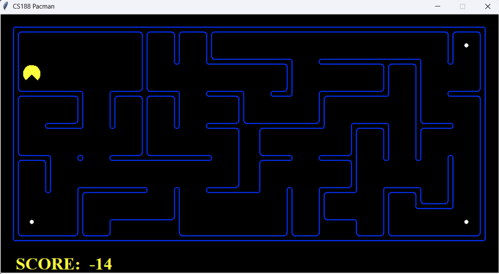
</p>


#### *Eating All the Dots (Food Search Problem)*

In this problem, Pacman must collect **all food dots present in the maze**.  
The state representation includes:

- Pacman's position
- the remaining food grid

This problem has a much larger state space compared to the Corners Problem, which makes heuristic design essential for efficient search.  
The A* algorithm is used together with a heuristic that estimates the distance to the farthest remaining food dot.

<p align="center">
  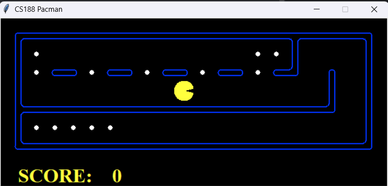
</p>


#### *Suboptimal Search*

In some scenarios, optimal search may be computationally expensive due to the large search space.  
Suboptimal search strategies can be applied to find solutions faster while sacrificing optimality.  
For example, heuristics may prioritize reaching food quickly rather than guaranteeing the shortest possible path.  
These strategies allow Pacman to make faster decisions in complex environments.

<p align="center">
  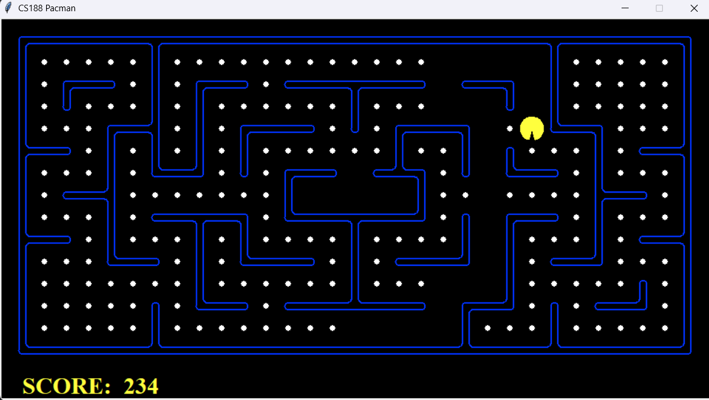
</p>

### Multi-Agent Algorithms
Implementation of adversarial search algorithms where Pacman interacts with ghost agents.


#### *Reflex Agent*
The Reflex Agent chooses actions based on an evaluation function that considers:

- distance to food
- distance to ghosts
- remaining food

The agent evaluates each possible action and selects the best one.

<p align="center">
  
</p>


#### *Minimax Algorithm*

Minimax models the interaction between Pacman and ghosts as a **two-player adversarial game**.  
Pacman tries to **maximize the score**, while ghosts attempt to **minimize it**.

<p align="center">
  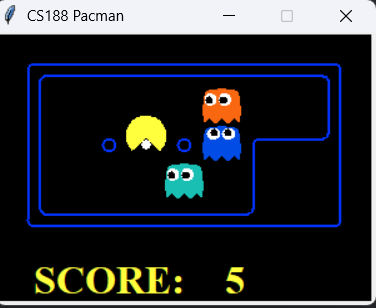
</p>


#### *Alpha-Beta Pruning*

Alpha-Beta pruning is an optimization of the Minimax algorithm.  
It reduces the number of nodes explored in the search tree by eliminating branches that cannot affect the final decision.  
Advantages:

- faster decision making
- same optimal result as Minimax

<p align="center">
  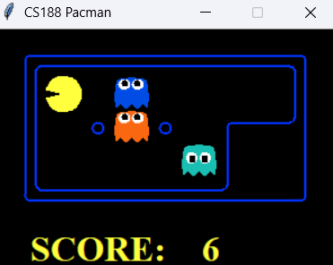
</p>


## Project Structure - some of the files

```
pacman-ai-project
│
├── multiagent
│   ├── multiAgents.py          # Multi-agent search algorithms
│   ├── pacman.py               # Main Pacman game engine
│   ├── pacmanAgents.py
│   ├── ghostAgents.py
│   ├── keyboardAgents.py
│   ├── game.py
│   ├── graphicsDisplay.py
│   ├── graphicsUtils.py
│   ├── layout.py
│   │
│   ├── layouts                 # Maze layouts
│   └── test_cases              # Test scenarios
│
├── search
│   ├── search.py               # Search algorithm implementations
│   ├── searchAgents.py
│   ├── util.py
│   ├── pacman.py
│   ├── game.py
│   │
│   ├── layouts
│   └── test_cases
│
├── doc_ia.pdf                  # Project documentation
├── images                      # Images for README
└── README.md
```

## Running the Project

### Run Pacman

```
python pacman.py
```

### Run Depth First Search

```
python pacman.py -l tinyMaze -p SearchAgent -a fn=dfs
```

### Run Breadth First Search

```
python pacman.py -l mediumMaze -p SearchAgent -a fn=bfs
```

### Run Uniform Cost Search

```
python pacman.py -l mediumMaze -p SearchAgent -a fn=ucs  
```

### Run A* Search

```
python pacman.py -l mediumMaze -p SearchAgent -a fn=astar
```

### Run Finding All the Corners (Corners Problem)
```
python pacman.py -l mediumCorners -p SearchAgent -a fn=bfs,prob=CornersProblem
```

### Run Corners Problem Heuristic
```
python pacman.py -l mediumCorners -p AStarCornersAgent
```

### Run Eating All the Dots (Food Search Problem)
```
python pacman.py -l trickySearch -p AStarFoodSearchAgent
```

### Run Suboptimal Search
```
python pacman.py -l bigSearch -p ClosestDotSearchAgent
```

### Run Reflex Agent

```
python pacman.py -p ReflexAgent
```

### Run Minimax Agent

```
python pacman.py -p MinimaxAgent -l minimaxClassic -a depth=3
```

### Run Alpha-Beta Agent

```
python pacman.py -p AlphaBetaAgent -l minimaxClassic -a depth=3
```

## Concepts Demonstrated

This project demonstrates several important concepts in **Artificial Intelligence**:

- Graph search algorithms
- Heuristic search
- Adversarial search
- Multi-agent decision making
- Game tree exploration
- Algorithm optimization


## Author
Francesca Lara Szarka  
Computer Science Student  
Technical University of Cluj-Napoca

